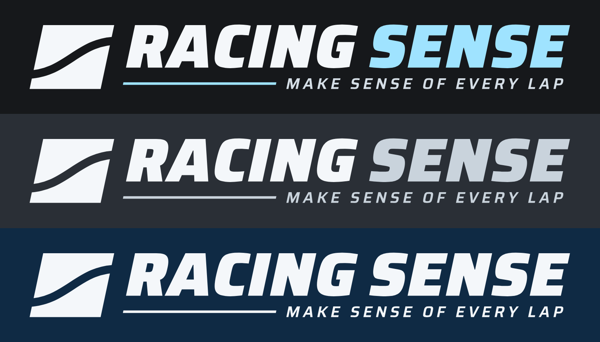
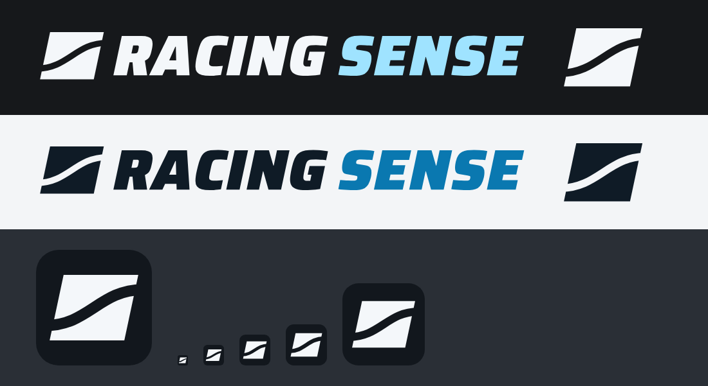

# Marca — Racing Sense

Logo horizontal com o slogan **Make sense of every lap**, em tons claros, pensada
para aplicação sobre fundo escuro (pintura do carro, tela do app).

## Arquivos

| Arquivo | Uso |
|---|---|
| `racing-sense-color.svg` / `.png` | principal: branco com "SENSE" e traço em azul-gelo `#9FE3FF` |
| `racing-sense-silver.svg` / `.png` | sóbria: branco com "SENSE" em prata `#C9D3DC` |
| `racing-sense-mono.svg` / `.png` | uma cor só (`#F4F7FA`), para vinil ou fundo colorido |

Os SVG são vetoriais, com o texto já convertido em curvas: não dependem de fonte
instalada. Os PNG têm fundo transparente e 4096 px de largura.

## Versões para o sistema (sem slogan)

Em `sistema/`, para o app desktop, a web e o ícone.

| Arquivo | Uso |
|---|---|
| `racing-sense-horizontal-clara.svg` / `.png` | cabeçalho em tema escuro: branco + "SENSE" azul-gelo `#9FE3FF` |
| `racing-sense-horizontal-escura.svg` / `.png` | cabeçalho em tema claro: tinta `#0F1B26` + "SENSE" azul `#0A78B0` |
| `racing-sense-horizontal-*-mono.svg` / `.png` | uma cor só, clara ou escura |
| `racing-sense-simbolo-clara.svg` / `-escura.svg` | só o símbolo, para espaço apertado (barra lateral, avatar) |
| `racing-sense-icone.svg` | ícone do app: símbolo claro sobre placa escura `#12171D` com cantos arredondados |
| `icone/racing-sense-{16…1024}.png` | o ícone em cada tamanho (favicon, atalho, instalador) |
| `icone/racing-sense.ico` | ícone do Windows com 16, 24, 32, 48, 64, 128 e 256 px |

Os PNG horizontais têm 2048 px de largura e os do símbolo, 1024 px, todos com
fundo transparente. No ícone, o recorte do S é mais grosso do que na logo para
continuar visível em 16 e 32 px.

## Construção

- **Símbolo:** paralelogramo inclinado a 12° com a linha de corrida em S vazada —
  o traçado atravessando uma sequência de curvas. O vazado mostra a cor do que
  estiver por baixo.
- **Nome:** Saira Black Italic (inclinação de 12°, a mesma do símbolo).
- **Slogan:** Saira SemiBold com a mesma inclinação, alinhado à direita, com um
  traço de velocidade ocupando o resto da largura.
- Proporção aproximada de 7:1.

Saira é licenciada sob a SIL Open Font License, que permite usá-la em logo.

## Na pintura (iRacing)

O template de pintura tem 2048 × 2048. Confira no template do carro quantos
pixels vão de eixo a eixo na lateral e reduza o PNG de 4096 px até essa largura,
ou importe o SVG. Não amplie o PNG. Lembre que cada lateral fica num lugar
diferente do template.
